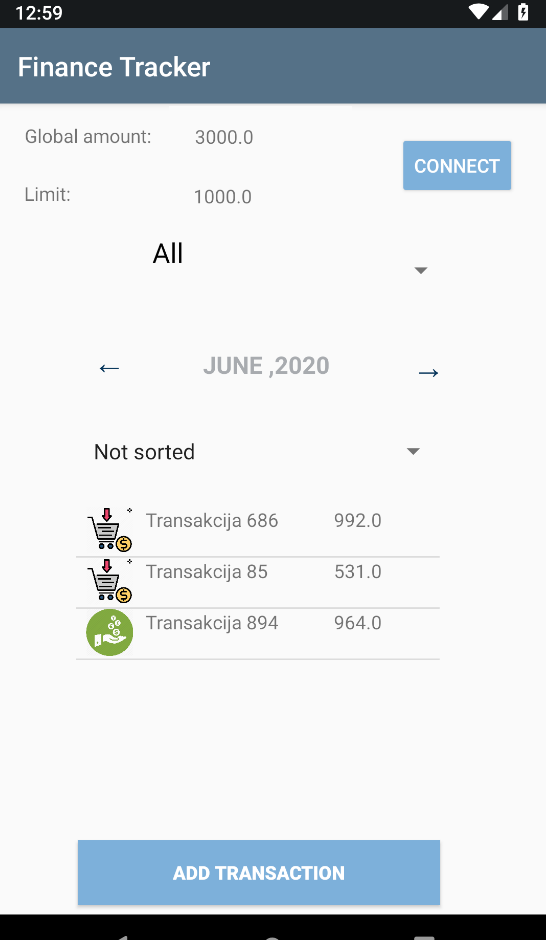
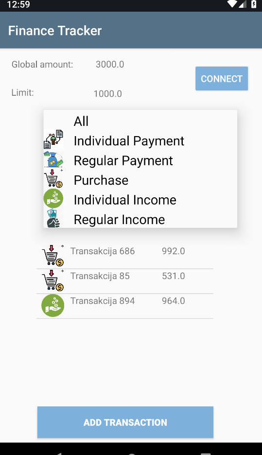
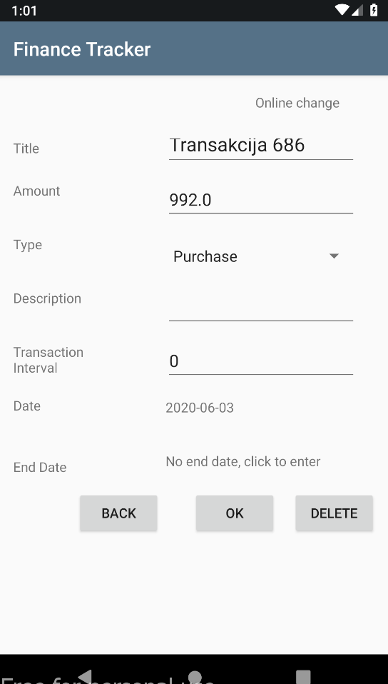
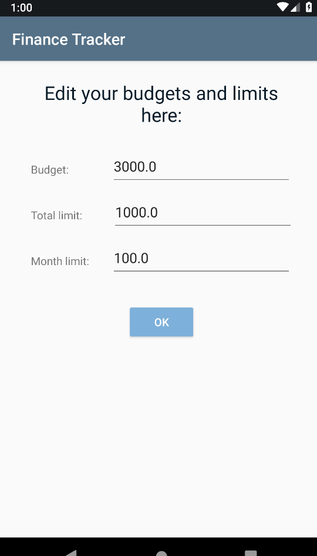
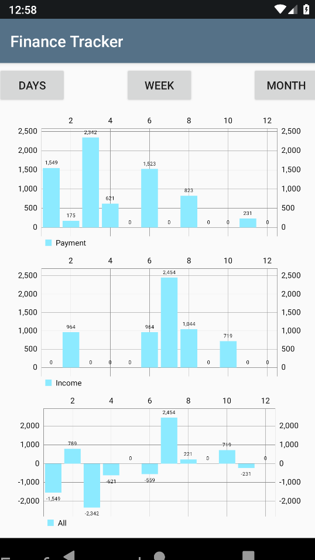

#  Personal Finance Tracker
### Project for Mobile App Development course, Faculty of Electrical Engineering 2019/20  

A simple mobile app for tracking personal finances using Web Service and SQLite local databes.  

# Features:

  - Sorting and filtering transactions by type, date, price or title 
  - Adding new transactions
  - Deleting and changing current transactions
  - Updating budget, total and mothly limits
  - Incomes and payments presented by graphs
  - Transactions are added to web service when online
  - In offline mode a local database is used

 

